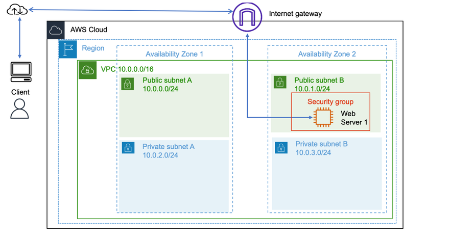
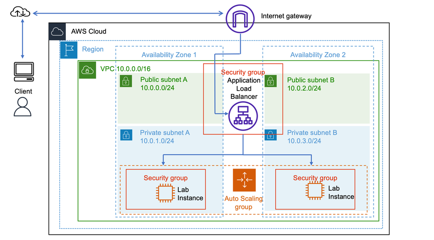

# AWS EC2 — Dimensionamento e Balanceamento de Carga

Laboratório prático realizado durante a formação em AWS, explorando o uso do **Amazon EC2**, **Application Load Balancer**, **EC2 Auto Scaling** e **Amazon CloudWatch**.

A atividade consiste em criar uma AMI a partir de uma instância EC2 existente, configurar um balanceador de carga, criar um modelo de execução e provisionar um grupo do Auto Scaling capaz de aumentar ou reduzir automaticamente a quantidade de instâncias conforme a utilização da aplicação.

## 🎯 Objetivo

Durante o laboratório, foram praticados:

- criação de uma AMI a partir de uma instância EC2;
- configuração de um Application Load Balancer;
- criação de um grupo de destino;
- configuração de listeners HTTP;
- criação de um modelo de execução;
- configuração de um grupo do EC2 Auto Scaling;
- execução de instâncias em sub-redes privadas;
- distribuição de instâncias entre duas Zonas de Disponibilidade;
- configuração de verificação de integridade pelo ELB;
- criação de uma política de escalabilidade baseada em CPU;
- criação de alarmes no Amazon CloudWatch;
- validação do balanceamento de carga;
- teste de escalabilidade automática durante um aumento de utilização.

## 🏗️ Arquitetura

### Arquitetura inicial

A arquitetura inicial possui uma única instância EC2 chamada `Web Server 1`, executada em uma sub-rede pública e acessível diretamente pela Internet.

Características da arquitetura inicial:

- VPC com CIDR `10.0.0.0/16`;
- duas Zonas de Disponibilidade;
- uma instância EC2;
- uma sub-rede pública;
- acesso direto à aplicação;
- ausência de balanceamento de carga;
- ausência de escalabilidade automática.

### Arquitetura final

Na arquitetura final, o Application Load Balancer recebe as requisições externas e distribui o tráfego entre instâncias EC2 executadas em sub-redes privadas de duas Zonas de Disponibilidade.

Características da arquitetura final:

- Application Load Balancer público;
- grupo de destino configurado com HTTP na porta 80;
- instâncias EC2 em sub-redes privadas;
- grupo do Auto Scaling;
- capacidade desejada de 2 instâncias;
- capacidade mínima de 2 instâncias;
- capacidade máxima de 4 instâncias;
- política de escalabilidade baseada na utilização média da CPU;
- monitoramento por meio do Amazon CloudWatch.

## ☁️ Serviços e recursos utilizados

| Serviço / Recurso | Utilização |
| --- | --- |
| **Amazon EC2** | Execução das instâncias da aplicação |
| **Amazon VPC** | Rede virtual utilizada pela infraestrutura |
| **Sub-redes públicas** | Hospedagem do Application Load Balancer |
| **Sub-redes privadas** | Hospedagem das instâncias do Auto Scaling |
| **Security Groups** | Controle do tráfego de rede |
| **Amazon Machine Image (AMI)** | Padronização das instâncias EC2 |
| **Application Load Balancer** | Distribuição das requisições HTTP |
| **Target Group** | Registro e verificação das instâncias |
| **EC2 Auto Scaling** | Criação e remoção automática de instâncias |
| **Amazon CloudWatch** | Monitoramento, métricas e alarmes |
| **Internet Gateway** | Comunicação entre a VPC e a Internet |

## 1. Criação da AMI

A primeira etapa consistiu em criar uma Amazon Machine Image a partir da instância EC2 `Web Server 1`.

A AMI armazena o sistema operacional, os arquivos e as configurações da instância original. Dessa forma, novas instâncias podem ser iniciadas com a mesma configuração.

Foram utilizadas as seguintes configurações:

- **Nome da imagem:** `Web Server AMI`;
- **Descrição:** `Lab AMI for Web Server`;
- **Instância de origem:** `Web Server 1`.

Após a solicitação, a AMI foi criada e ficou disponível para ser utilizada no modelo de execução.

## 2. Criação do Application Load Balancer

O Application Load Balancer foi criado para distribuir as requisições HTTP entre as instâncias EC2.

Configurações principais:

- **Nome:** `LabELB`;
- **Esquema:** Internet-facing;
- **Tipo de endereço IP:** IPv4;
- **VPC:** VPC do laboratório;
- **Zonas de Disponibilidade:** duas zonas;
- **Sub-redes:** sub-redes públicas;
- **Protocolo:** HTTP;
- **Porta:** 80;
- **Grupo de segurança:** grupo de segurança da aplicação.

O balanceador foi configurado para receber tráfego da Internet e encaminhá-lo para o grupo de destino.

## 3. Criação do grupo de destino

Foi criado um grupo de destino para registrar as instâncias EC2 que receberão as requisições encaminhadas pelo Application Load Balancer.

Configurações utilizadas:

- **Tipo de destino:** Instâncias;
- **Nome:** `lab-target-group-174`;
- **Protocolo:** HTTP;
- **Porta:** 80;
- **Tipo de endereço IP:** IPv4;
- **VPC:** VPC do laboratório.

O grupo de destino utiliza verificações de integridade para identificar se as instâncias estão disponíveis e aptas a receber tráfego.

## 4. Configuração do balanceador

Após a criação do grupo de destino, ele foi associado ao listener HTTP do Application Load Balancer.

O listener foi configurado para encaminhar as requisições recebidas na porta 80 para o grupo `lab-target-group-174`.

Essa configuração permite que o balanceador envie tráfego apenas para instâncias consideradas saudáveis pelo mecanismo de verificação de integridade.

## 5. Criação do modelo de execução

Foi criado o modelo de execução `lab-app-launch-template` para definir as configurações das instâncias iniciadas pelo Auto Scaling.

Configurações principais:

- **Nome:** `lab-app-launch-template`;
- **Descrição:** `A web server for the load test app`;
- **AMI:** `Web Server AMI`;
- **Tipo de instância:** `t3.micro`;
- **Grupo de segurança:** grupo de segurança da aplicação;
- **Par de chaves:** não incluído;
- **Orientação:** configuração para uso com o EC2 Auto Scaling.

O modelo de execução garante que todas as novas instâncias sejam iniciadas de maneira padronizada.

## 6. Criação do grupo do Auto Scaling

O grupo do Auto Scaling foi criado utilizando o modelo de execução configurado anteriormente.

Configurações de rede:

- **VPC:** VPC do laboratório;
- **Sub-rede privada 1:** `10.0.1.0/24`;
- **Sub-rede privada 2:** `10.0.3.0/24`;
- **Zonas de Disponibilidade:** duas zonas;
- **Distribuição:** melhor esforço equilibrado.

O grupo foi associado ao grupo de destino `lab-target-group-174` e configurado para utilizar verificações de integridade do ELB.

Configurações de capacidade:

- **Capacidade desejada:** 2 instâncias;
- **Capacidade mínima:** 2 instâncias;
- **Capacidade máxima:** 4 instâncias;
- **Política:** rastreamento de destino;
- **Métrica:** utilização média da CPU;
- **Valor-alvo:** 50%.

## 7. Validação da aplicação

Após a criação do grupo do Auto Scaling, as instâncias foram iniciadas automaticamente nas sub-redes privadas.

A aplicação de teste de carga foi acessada por meio do DNS público do Application Load Balancer.

A validação confirmou que:

- o Application Load Balancer recebeu as requisições;
- o tráfego foi encaminhado ao grupo de destino;
- as instâncias foram registradas corretamente;
- as verificações de integridade foram executadas;
- a aplicação ficou disponível por meio do DNS do balanceador.

## 8. Monitoramento com Amazon CloudWatch

Foram criados alarmes no Amazon CloudWatch para monitorar a utilização média da CPU das instâncias do Auto Scaling.

Os alarmes foram configurados para acompanhar dois cenários:

- utilização elevada da CPU, acionando o aumento da capacidade;
- utilização reduzida da CPU, permitindo a redução da capacidade.

## 9. Teste de escalabilidade automática

Para testar o comportamento do Auto Scaling, a aplicação foi submetida a uma carga elevada.

Quando a utilização média da CPU ultrapassou 50% durante o período configurado, o alarme entrou em estado de alerta.

Esse evento acionou a política de escalabilidade, permitindo que novas instâncias fossem iniciadas automaticamente para atender ao aumento da demanda.

## 📚 Conhecimentos praticados

Este laboratório permitiu praticar conceitos fundamentais de infraestrutura e escalabilidade na AWS:

- **Amazon EC2:** criação e gerenciamento de instâncias;
- **AMI:** criação de imagens reutilizáveis;
- **VPC e Subnet:** organização da infraestrutura de rede;
- **Sub-redes públicas e privadas:** separação entre entrada e processamento;
- **Security Groups:** controle do tráfego de rede;
- **Application Load Balancer:** distribuição das requisições;
- **Target Groups:** registro e monitoramento dos destinos;
- **Health Checks:** validação da saúde das instâncias;
- **EC2 Auto Scaling:** ajuste automático da capacidade;
- **Amazon CloudWatch:** criação de métricas e alarmes;
- **Zonas de Disponibilidade:** aumento da disponibilidade da aplicação;
- **Políticas de escalabilidade:** resposta automática à variação de demanda.

## 💡 Balanceamento de carga e Auto Scaling

O **Application Load Balancer** é responsável por distribuir o tráfego de entrada entre as instâncias disponíveis no grupo de destino.

O **EC2 Auto Scaling** é responsável por manter a capacidade adequada da aplicação. Quando a utilização aumenta, novas instâncias podem ser adicionadas. Quando a demanda diminui, a quantidade de instâncias pode ser reduzida, respeitando os limites mínimo e máximo configurados.

A combinação desses serviços proporciona:

- maior disponibilidade;
- tolerância a falhas;
- distribuição equilibrada de tráfego;
- escalabilidade automática;
- melhor utilização dos recursos;
- redução da dependência de uma única instância.

## ✅ Resultado

Ao final do laboratório, foi possível:

1. criar uma AMI a partir da instância `Web Server 1`;
2. configurar um Application Load Balancer público;
3. criar um grupo de destino HTTP;
4. configurar verificações de integridade;
5. criar um modelo de execução;
6. configurar um grupo do Auto Scaling;
7. iniciar instâncias em sub-redes privadas;
8. distribuir as instâncias entre duas Zonas de Disponibilidade;
9. associar o Auto Scaling ao Application Load Balancer;
10. configurar alarmes no Amazon CloudWatch;
11. acessar a aplicação pelo DNS do balanceador;
12. provocar um aumento de carga;
13. validar o acionamento da política de escalabilidade automática.

---

**Laboratório de estudos — AWS / Generation Brasil**