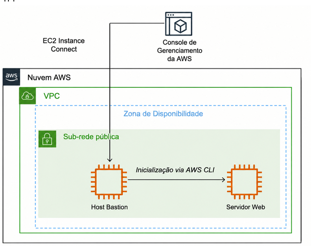
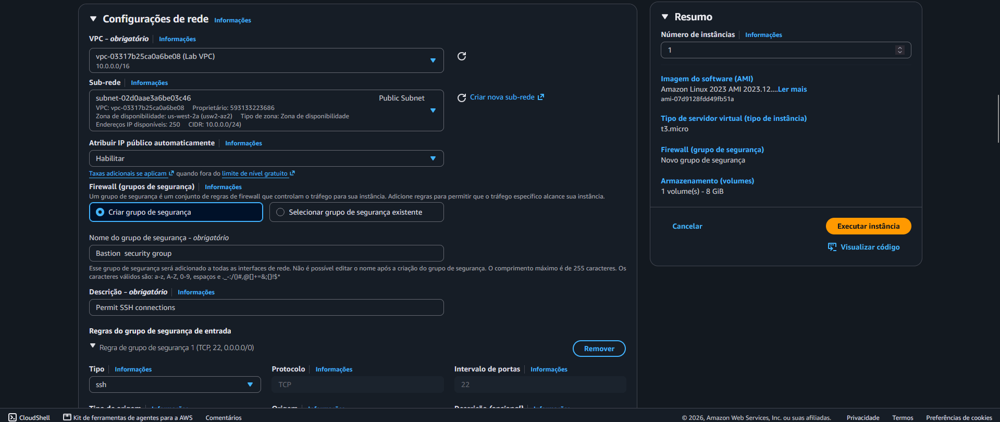
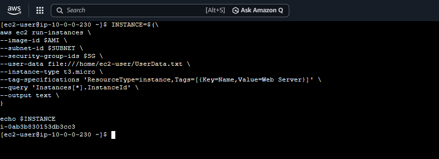
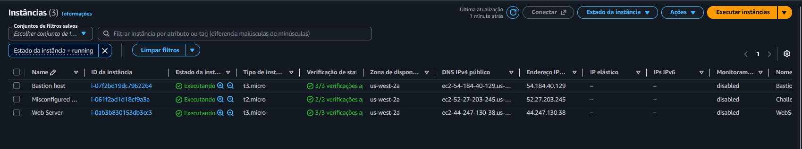
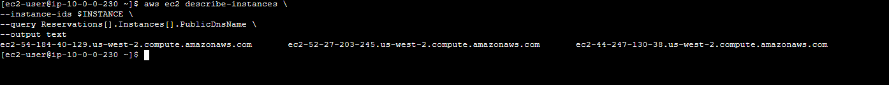

# AWS EC2 — Instance Provisioning

Laboratório prático de **Amazon EC2** realizado durante a formação em AWS, explorando o provisionamento de instâncias pelo **Console de Gerenciamento da AWS** e pela **AWS CLI**.

A atividade consiste em criar uma instância EC2 como **Bastion Host**, acessá-la com **EC2 Instance Connect** e, a partir dela, provisionar uma segunda instância como **Web Server** utilizando a AWS CLI.

## 🎯 Objetivo

Durante o laboratório, foram praticados:

- criação de uma instância EC2 pelo Console da AWS;
- configuração de VPC, sub-rede pública e Security Group;
- acesso à instância com EC2 Instance Connect;
- uso de IAM Instance Profile;
- consulta de AMI pelo Systems Manager Parameter Store;
- recuperação de recursos de rede com AWS CLI;
- provisionamento de uma instância com `aws ec2 run-instances`;
- configuração de servidor web com User Data;
- monitoramento de instâncias com `aws ec2 describe-instances`;
- consulta do DNS público para validar o servidor web.

## 🏗️ Arquitetura

A arquitetura representa o fluxo utilizado no laboratório: o **Bastion Host** é criado pelo Console de Gerenciamento da AWS e, a partir dele, a **AWS CLI** é utilizada para inicializar o **Web Server** dentro da infraestrutura de rede.



## ☁️ Serviços e recursos utilizados

| Serviço / Recurso | Utilização |
|---|---|
| **Amazon EC2** | Criação e gerenciamento das instâncias |
| **Amazon VPC** | Rede utilizada pelas instâncias |
| **Public Subnet** | Sub-rede pública do laboratório |
| **Security Group** | Controle do tráfego das instâncias |
| **EC2 Instance Connect** | Acesso ao Bastion Host |
| **AWS CLI** | Provisionamento e consulta dos recursos |
| **Systems Manager Parameter Store** | Recuperação da AMI do Amazon Linux 2 |
| **IAM Instance Profile** | Permissões para a instância realizar chamadas à AWS |
| **User Data** | Configuração automática do servidor web |

## 1. Provisionamento do Bastion Host

A primeira instância foi criada pelo **Console de Gerenciamento da AWS**.

Configurações principais:

- **Nome:** `Bastion host`
- **AMI:** Amazon Linux 2
- **Tipo:** `t3.micro`
- **VPC:** `Lab VPC`
- **Sub-rede:** `Public Subnet`
- **IP público:** habilitado
- **Security Group:** `Bastion security group`
- **IAM Instance Profile:** `Bastion-Role`

O Security Group foi utilizado para controlar o tráfego da instância, enquanto o `Bastion-Role` forneceu as permissões necessárias para que a instância pudesse realizar chamadas aos serviços AWS durante o restante do laboratório.



## 2. Acesso com EC2 Instance Connect

Após iniciar o Bastion Host, foi utilizado o **EC2 Instance Connect** para estabelecer uma sessão diretamente na instância.

A partir desse terminal, os próximos comandos foram executados utilizando a **AWS CLI**.

## 3. Recuperação da AMI

Para criar o Web Server, foi necessário definir uma AMI. O laboratório utiliza o **AWS Systems Manager Parameter Store** para recuperar a AMI mais recente do Amazon Linux 2.

```bash
AMI=$(aws ssm get-parameters --names /aws/service/ami-amazon-linux-latest/amzn2-ami-hvm-x86_64-gp2 --query 'Parameters[0].[Value]' --output text)

echo $AMI
```

O ID retornado foi armazenado na variável `AMI` e utilizado posteriormente no provisionamento da nova instância.

## 4. Recuperação da rede e do Security Group

A nova instância deveria ser criada na **Public Subnet** e utilizar o grupo de segurança destinado ao servidor web.

### Public Subnet

```bash
SUBNET=$(aws ec2 describe-subnets --filters 'Name=tag:Name,Values=Public Subnet' --query Subnets[].SubnetId --output text)

echo $SUBNET
```

### Web Security Group

```bash
SG=$(aws ec2 describe-security-groups --filters Name=group-name,Values=WebSecurityGroup --query SecurityGroups[].GroupId --output text)

echo $SG
```

Os comandos permitem recuperar os identificadores diretamente do ambiente AWS, que posteriormente são utilizados no comando de criação da instância.

## 5. Configuração do Web Server com User Data

O laboratório utiliza um script de **User Data** para configurar automaticamente a nova instância durante sua inicialização.

O script é responsável por:

- instalar o servidor web;
- baixar o pacote da aplicação web;
- instalar a aplicação.

O arquivo foi disponibilizado na instância e passado ao comando `run-instances`.

## 6. Provisionamento do Web Server com AWS CLI

Com a AMI, a sub-rede e o Security Group definidos, a segunda instância foi criada com `aws ec2 run-instances`.

```bash
INSTANCE=$(aws ec2 run-instances --image-id $AMI --subnet-id $SUBNET --security-group-ids $SG --user-data file:///home/ec2-user/UserData.txt --instance-type t3.micro --tag-specifications 'ResourceType=instance,Tags=[{Key=Name,Value=Web Server}]' --query 'Instances[*].InstanceId' --output text )

echo $INSTANCE
```

O comando reúne os parâmetros necessários para o provisionamento:

- `--image-id`: define a AMI;
- `--subnet-id`: define a sub-rede;
- `--security-group-ids`: associa o Security Group;
- `--user-data`: executa o script de inicialização;
- `--instance-type`: define `t3.micro`;
- `--tag-specifications`: identifica a instância como `Web Server`;
- `--query`: retorna o ID da instância;
- `--output text`: apresenta o resultado em texto.



## 7. Validação das instâncias

Após o provisionamento, as instâncias foram verificadas no console do Amazon EC2.

Foi possível confirmar o **Bastion Host** e o **Web Server** em execução, além de visualizar informações como tipo de instância, zona de disponibilidade e IP público.



## 8. Monitoramento do estado

A AWS CLI também foi utilizada para consultar o estado da nova instância:

```bash
aws ec2 describe-instances --instance-ids $INSTANCE --query 'Reservations[].Instances[].State.Name' --output text
```

O comando permite acompanhar a transição da instância até o estado `running`.

## 9. Validação do Web Server

Depois que a instância ficou disponível, foi consultado o DNS IPv4 público:

```bash
aws ec2 describe-instances --instance-ids $INSTANCE --query Reservations[].Instances[].PublicDnsName --output text
```

O DNS retornado foi utilizado no navegador para verificar se o servidor web havia sido iniciado e configurado corretamente.



## 📚 Conhecimentos praticados

Este laboratório permitiu praticar conceitos fundamentais de provisionamento e gerenciamento de recursos na AWS:

- **Amazon EC2:** criação e gerenciamento de instâncias;
- **AMI:** utilização de uma imagem como base para uma instância;
- **VPC e Subnet:** definição da infraestrutura de rede;
- **Security Groups:** controle do tráfego das instâncias;
- **IAM Instance Profile:** concessão de permissões para aplicações executadas na EC2;
- **EC2 Instance Connect:** acesso à instância;
- **AWS CLI:** gerenciamento programático dos recursos;
- **Systems Manager Parameter Store:** recuperação dinâmica da AMI;
- **User Data:** automação da configuração durante a inicialização;
- **AWS CLI Query:** seleção de informações específicas dos recursos;
- **DNS público:** validação do acesso ao servidor web.

## 💡 Console x AWS CLI

O laboratório também demonstrou duas formas de trabalhar com recursos EC2.

O **Console da AWS** permite realizar o provisionamento de forma visual, preenchendo as configurações da instância.

A **AWS CLI** permite fornecer essas configurações diretamente por comandos. Isso possibilita automatizar tarefas e transformar o processo de provisionamento em um fluxo repetível.

## ✅ Resultado

Ao final do laboratório, foi possível:

1. criar um **Bastion Host** pelo Console da AWS;
2. acessar a instância utilizando **EC2 Instance Connect**;
3. utilizar a **AWS CLI** a partir do Bastion Host;
4. recuperar AMI, sub-rede e Security Group por comandos;
5. provisionar um **Web Server EC2** com `run-instances`;
6. configurar o servidor utilizando **User Data**;
7. consultar o estado e o DNS público da instância;
8. validar o funcionamento do servidor web.

---

**Laboratório de estudos — AWS / Generation Brasil**
