# 🌐 Laboratório AWS: Criando uma rede roteável em uma VPC

> Laboratório prático de redes na AWS: montei uma VPC do zero, liguei ela à internet e provei que funciona com um simples `ping`.


---

## 📖 O cenário

Neste laboratório eu assumi o papel de **engenheiro de suporte de nuvem da AWS**. Um cliente fictício, o Brock, dono de uma startup, mandou este e-mail:

> *"Eu pensei que sabia anexar todos os recursos para fazer uma conexão com a internet, mas não consigo nem fazer ping fora da VPC. Só preciso fazer ping!"*

Ou seja: a instância dele estava dentro da VPC, mas **sem caminho para a internet**. Meu trabalho era montar (ou consertar) a infraestrutura até o `ping` funcionar.

**Critério de sucesso:** conseguir dar `ping` para fora da VPC a partir de uma instância EC2.

---

## 🏗️ Arquitetura

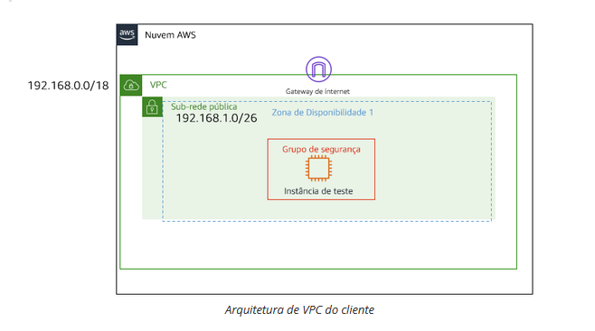

| Recurso | Configuração |
|---|---|
| **Região** | US West (Oregon) – `us-west-2` |
| **VPC** | `Test VPC` – `192.168.0.0/18` |
| **Sub-rede pública** | `Public subnet` – `192.168.1.0/28` (AZ `us-west-2a`) |
| **Internet Gateway** | `IGW test VPC` |
| **Tabela de rotas** | `Public route table` |
| **Network ACL** | `Public Subnet NACL` |
| **Security Group** | `Test VPC` (SSH, HTTP, HTTPS) |
| **Instância EC2** | `EC2-teste` – Amazon Linux 2023, `t3.micro` |

---

## 🧠 Conceitos que eu precisei entender

Antes de sair clicando, revisei o papel de cada peça:

- **VPC**: um "data center virtual" isolado dentro da AWS.
- **Sub-rede**: um pedaço do intervalo de IPs da VPC.
- **Internet Gateway (IGW)**: a porta de saída da VPC para a internet.
- **Tabela de rotas**: o "GPS" da rede. Para a internet funcionar, ela precisa de uma rota `0.0.0.0/0` apontando para o IGW.
- **Security Group**: firewall no nível da **instância**, é *stateful*.
- **Network ACL (NACL)**: firewall no nível da **sub-rede**, é *stateless*.
- **IP público**: sem ele, a instância não é alcançável nem alcança a internet, mesmo com tudo configurado.

---

## 🛠️ Passo a passo

A dica do próprio laboratório foi seguir o menu lateral do console da VPC **de cima para baixo**. Funciona bem, porque cada recurso depende do anterior.

### 1️⃣ Criar a VPC
Em **Suas VPCs → Criar VPC**, escolhi *Somente VPC*, nomeei como `Test VPC` e usei o CIDR `192.168.0.0/18`. O resto ficou no padrão.

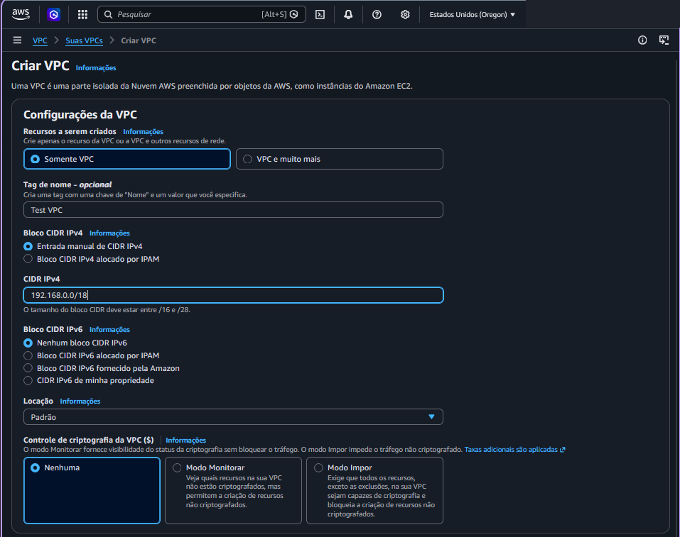

### 2️⃣ Criar a sub-rede pública
Dentro da `Test VPC`, criei a `Public subnet` com o bloco `192.168.1.0/28` na zona `us-west-2a`.

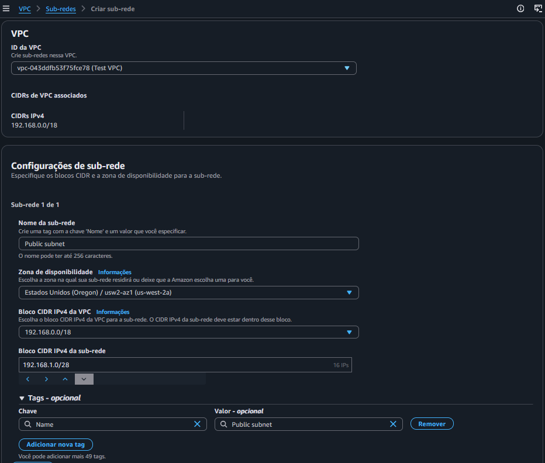

### 3️⃣ Criar a tabela de rotas
Criei a `Public route table` associada à `Test VPC`.


### 4️⃣ Criar e anexar o Internet Gateway
Criei o `IGW test VPC` e, depois, usei **Ações → Associar à VPC** para anexá-lo à `Test VPC`. *Criar não basta, tem que anexar!*

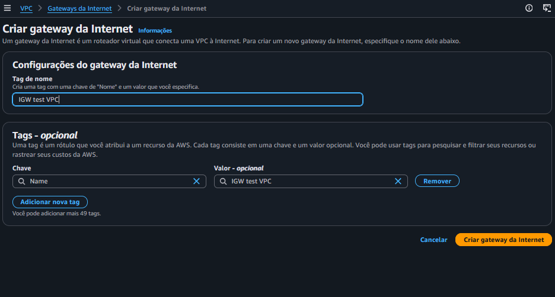
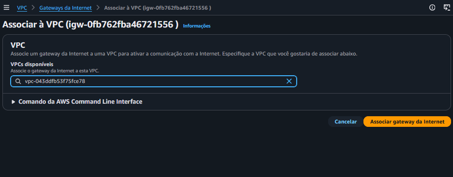

### 5️⃣ Adicionar a rota para a internet e associar a sub-rede
Na `Public route table`, adicionei a rota:

| Destino | Alvo |
|---|---|
| `192.168.0.0/18` | `local` (já vem por padrão) |
| `0.0.0.0/0` | Internet Gateway (`IGW test VPC`) |

Depois, na aba **Associações de sub-rede**, associei a `Public subnet` a essa tabela.


### 6️⃣ Criar a Network ACL
Criei a `Public Subnet NACL` e configurei uma regra de **entrada** e uma de **saída**, ambas com número `100`, tipo *Todo o tráfego*, origem/destino `0.0.0.0/0` e ação **Permitir**. O `*` que aparece logo abaixo é a regra padrão que nega todo o resto.

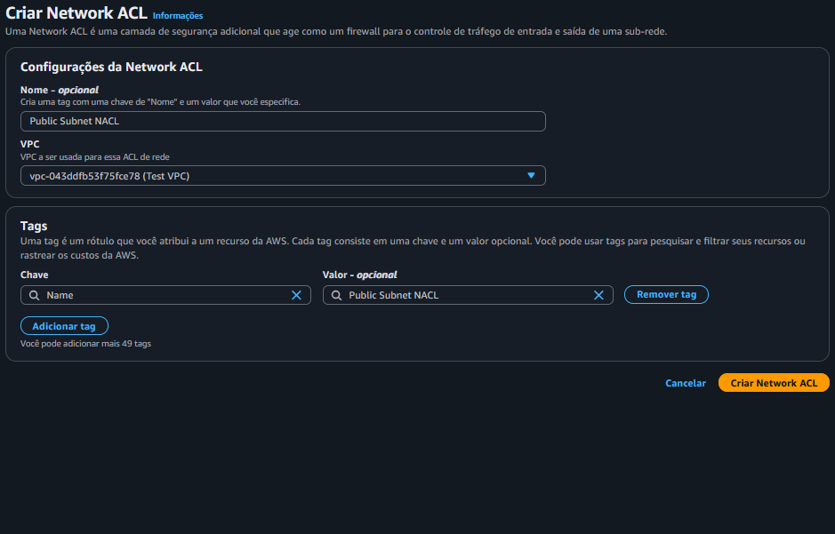
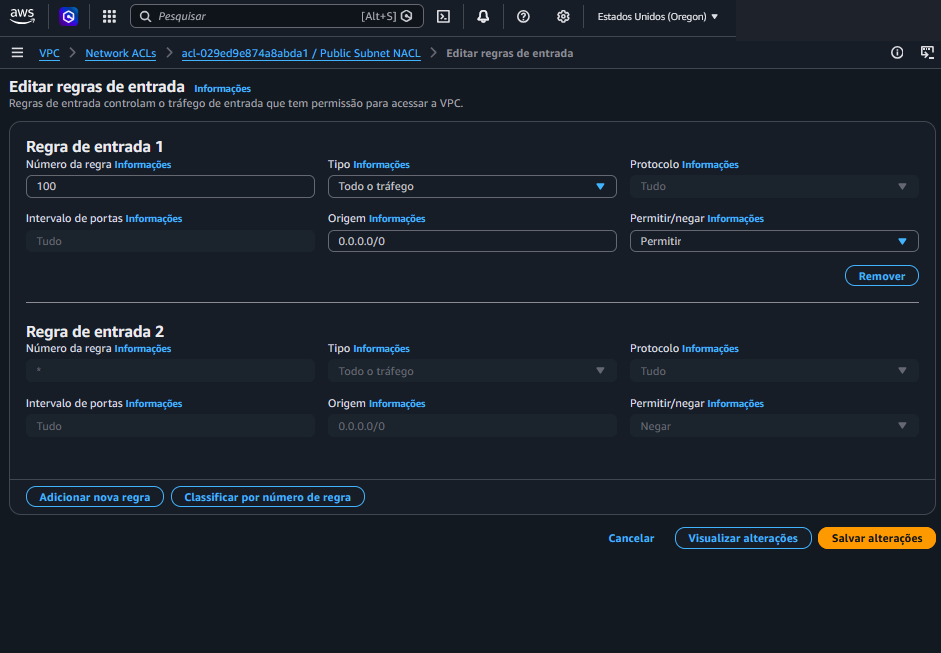
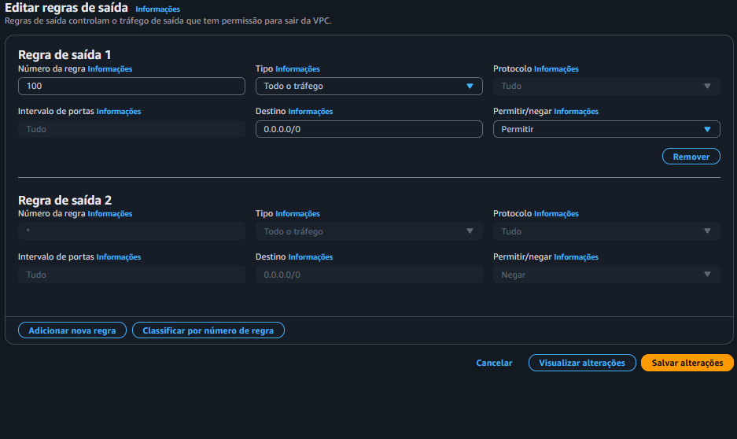

### 7️⃣ Criar o Security Group
Criei o grupo na `Test VPC` com:

- **Entrada:** SSH (22), HTTP (80) e HTTPS (443)
- **Saída:** todo o tráfego

> 🔒 No SSH, em vez de liberar para o mundo todo, usei a opção **"Meu IP"**. É uma boa prática de segurança: só a minha máquina consegue tentar entrar na instância.

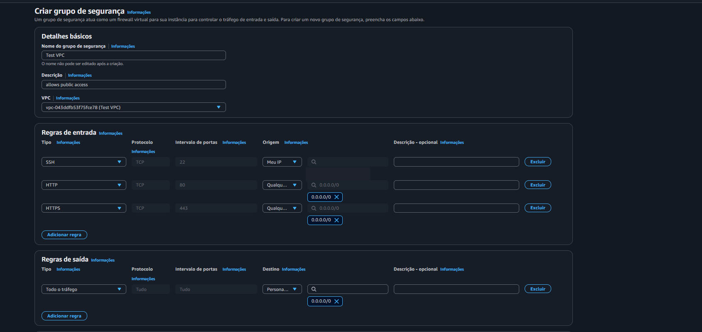

### 8️⃣ Conferir o mapa de recursos
Antes de subir a instância, olhei o **Mapa de recursos** da VPC para ver se tudo estava conectado: sub-rede → tabela de rotas → IGW. Estava. ✅


### 9️⃣ Lançar a instância EC2
No console do EC2, em **Executar instância**:

| Campo | Valor |
|---|---|
| Nome | `EC2-teste` |
| AMI | Amazon Linux 2023 |
| Tipo | `t3.micro` |
| Par de chaves | `vockey` |
| VPC | `Test VPC` |
| Sub-rede | `Public subnet` |
| IP público automático | **Habilitar** |
| Security Group | `Test VPC` (existente) |

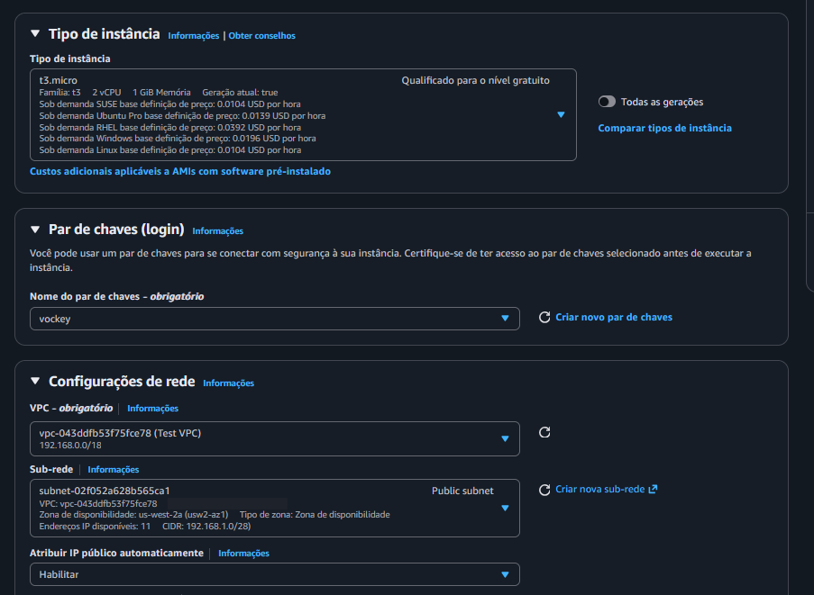
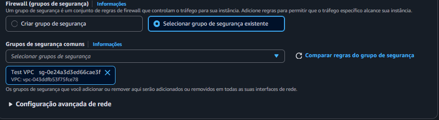
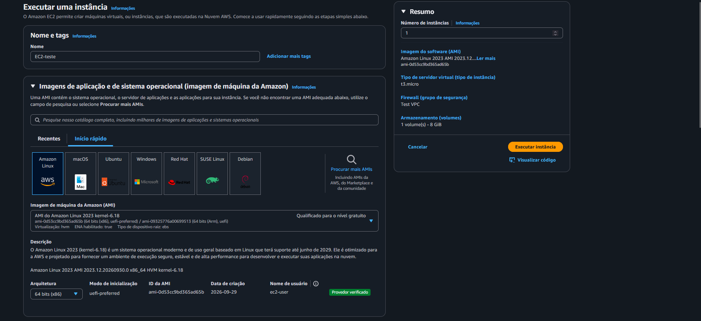

### 🔟 Conectar via SSH e testar o ping
Conectei na instância por SSH usando um terminal e rodei:

```bash
ping google.com
```

---

## ✅ Resultado

O `ping` respondeu, com latência em torno de **7–8 ms** e **0 pacotes perdidos** durante o teste. A instância (IP privado `192.168.1.7`) está alcançando a internet, então o problema do Brock estava resolvido. 🎉

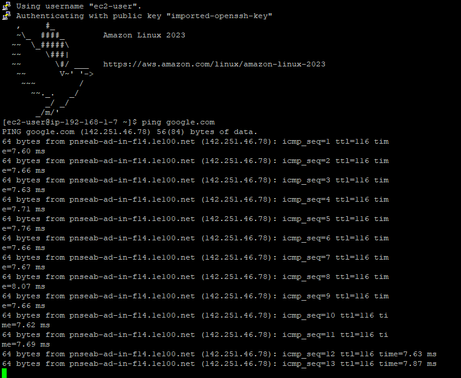

---

## 📝 Observações

- **Tamanho da sub-rede:** o enunciado e o diagrama citam `192.168.1.0/26`, mas na prática usei `/28` (16 IPs, dos quais a AWS reserva 5, sobrando 11 utilizáveis). Ambos cabem dentro da VPC `/18` e para o laboratório isso não muda o resultado.
- **Network ACL:** criei a NACL com regras que liberam tudo, mas é importante lembrar que uma NACL só passa a valer para a sub-rede depois de **associada** a ela. Sem isso, a sub-rede continua usando a NACL padrão da VPC (que também libera tudo).
- **Nomes:** o laboratório sugeria `public security group` como nome do Security Group; no meu caso ele ficou como `Test VPC`. Em um ambiente real, vale seguir uma convenção de nomes clara.

---

## 💡 O que eu aprendi

1. **Conectividade com a internet é um conjunto de peças**: IGW anexado + rota `0.0.0.0/0` + sub-rede associada + IP público + firewalls liberados. Se uma falhar, o `ping` não funciona.
2. **Seguir uma ordem ajuda a diagnosticar problemas**: ir de cima para baixo (VPC → sub-rede → rotas → IGW → segurança → instância) evita esquecer recursos.
3. **Convenção de nomes importa**: `Public subnet`, `Public route table`... Quando a rede cresce, isso salva muito tempo.
4. **Security Group ≠ NACL**: um é *stateful* e protege a instância; o outro é *stateless* e protege a sub-rede.

---

## 🧰 Tecnologias e serviços usados

`AWS VPC` · `Internet Gateway` · `Route Tables` · `Network ACL` · `Security Groups` · `Amazon EC2` · `Amazon Linux 2023` · `SSH`

---
## 👨‍💻 Autor

**Kauã Muniz**

Estudante de Engenharia de Software | Cloud Computing | AWS | Backend
