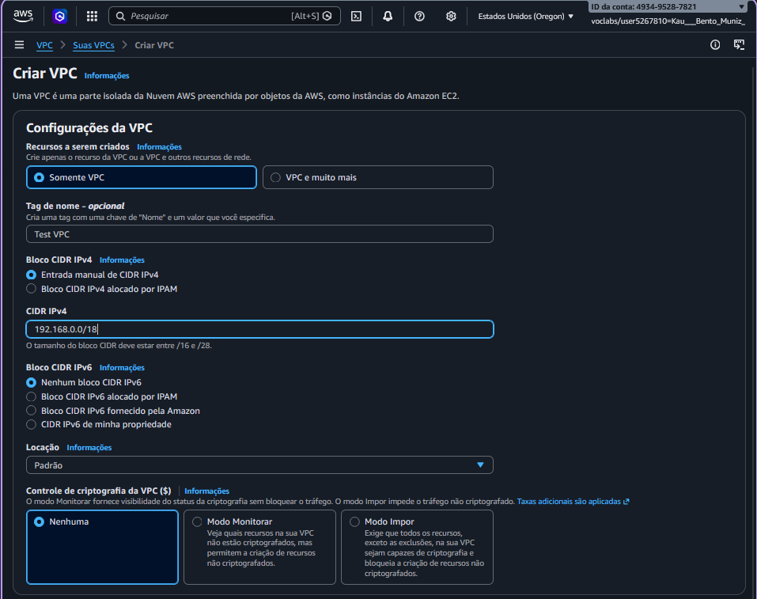
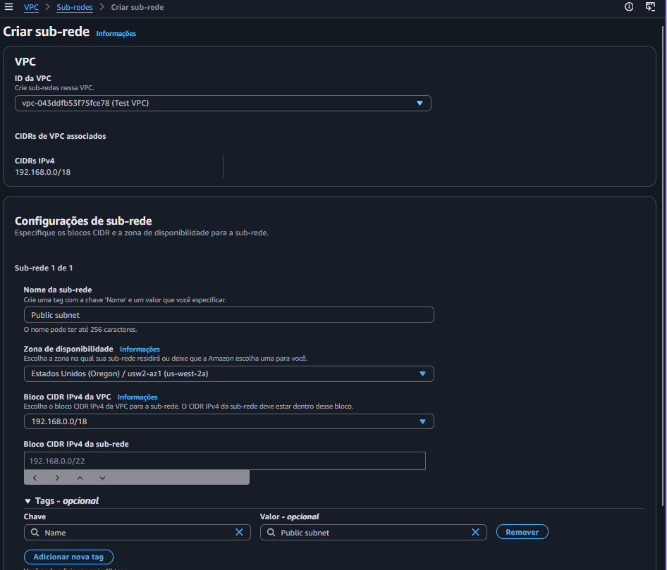
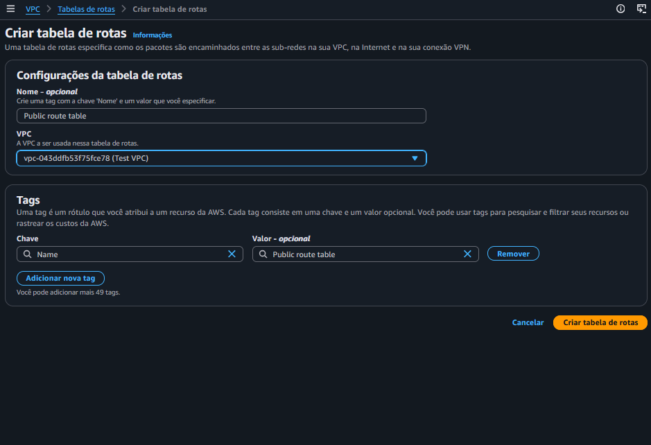
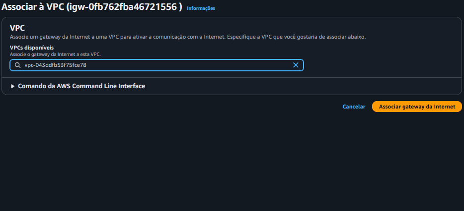
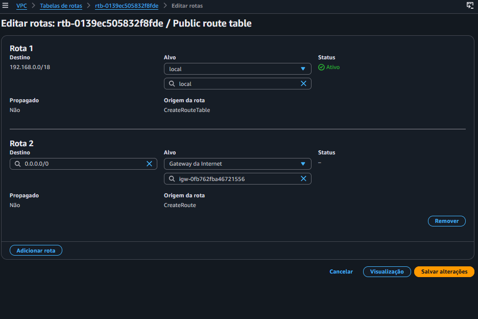
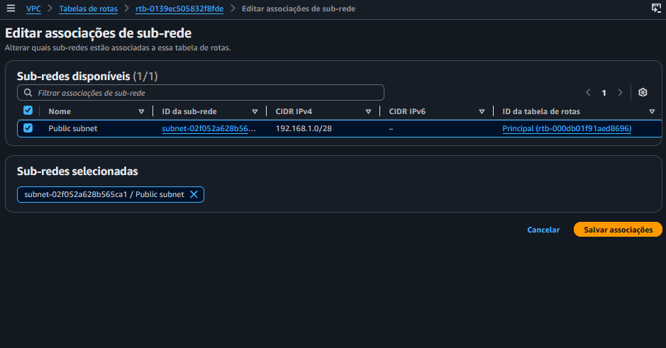
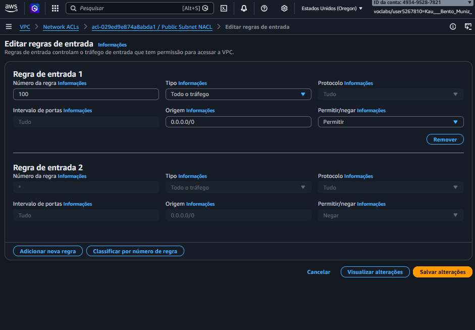
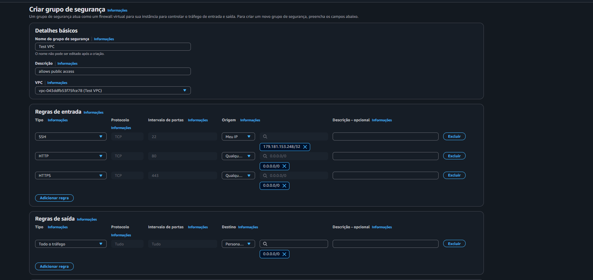
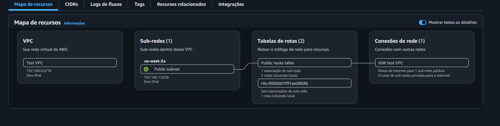
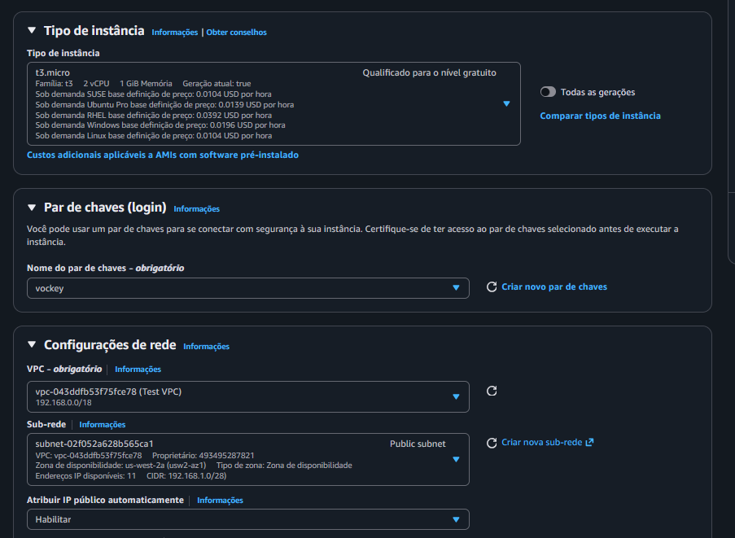

# AWS VPC Networking Lab

> Laboratório prático de AWS Networking, com criação e configuração de uma VPC com acesso à internet utilizando Amazon VPC, Internet Gateway, Route Table, Network ACL, Security Group e Amazon EC2.

## 📌 Sobre o projeto

Neste laboratório, o objetivo foi configurar uma infraestrutura de rede dentro da AWS capaz de se comunicar com a internet.

O cenário parte de um problema de conectividade: uma VPC já possuía parte de sua estrutura, mas não conseguia estabelecer comunicação com a internet. A partir disso, foram criados e configurados os recursos necessários para tornar a rede funcional.

Ao final, uma instância Amazon EC2 foi executada dentro de uma sub-rede pública e utilizada para testar a conectividade com a internet por meio do comando `ping`.

## 🎯 Objetivos

Durante o laboratório, foram trabalhados os seguintes pontos:

* Criar e configurar uma **Amazon VPC**.
* Criar uma **sub-rede pública**.
* Criar e associar uma **Route Table**.
* Criar e anexar um **Internet Gateway (IGW)**.
* Configurar uma rota padrão para a internet.
* Criar e configurar uma **Network ACL (NACL)**.
* Criar e configurar um **Security Group**.
* Provisionar uma instância **Amazon EC2**.
* Acessar a instância utilizando **SSH**.
* Testar a conectividade da instância com a internet utilizando `ping`.

## 🏗️ Arquitetura

A infraestrutura configurada segue o seguinte fluxo:

**Internet → Internet Gateway → Route Table → Public Subnet → EC2**

### VPC

```text
CIDR: 192.168.0.0/18
```

### Sub-rede pública

```text
CIDR: 192.168.1.0/28
```

## ☁️ Serviços e recursos utilizados

| Serviço / Recurso     | Utilização                                            |
| --------------------- | ----------------------------------------------------- |
| **Amazon VPC**        | Criação da rede virtual para os recursos AWS          |
| **Subnet**            | Segmentação da VPC onde a instância EC2 foi executada |
| **Internet Gateway**  | Conexão da VPC com a internet                         |
| **Route Table**       | Definição do caminho que o tráfego deve seguir        |
| **Network ACL**       | Controle do tráfego no nível da sub-rede              |
| **Security Group**    | Controle do tráfego associado à instância EC2         |
| **Amazon EC2**        | Instância utilizada para testar a conectividade       |
| **Amazon Linux 2023** | Sistema operacional utilizado na instância            |
| **SSH**               | Acesso remoto à instância EC2                         |

## ⚙️ Configuração da infraestrutura

### 1. Amazon VPC

A primeira etapa foi criar a VPC que servirá como base para toda a infraestrutura de rede.

```text
Nome: Test VPC
CIDR IPv4: 192.168.0.0/18
```


### 2. Sub-rede pública

Em seguida, foi criada uma sub-rede dentro da VPC para hospedar a instância EC2.

```text
Nome: Sub-rede pública
CIDR IPv4: 192.168.1.0/28
```



### 3. Route Table

Foi criada uma tabela de rotas para controlar o tráfego da sub-rede pública.

```text
Nome: Tabela de rotas públicas
```



### 4. Internet Gateway

Para permitir que os recursos da VPC se comuniquem com a internet, foi criado um **Internet Gateway** e anexado à `Test VPC`.




### 5. Rota para a internet

Depois, foi configurada uma rota padrão na Route Table:

```text
Destino: 0.0.0.0/0
Target: Internet Gateway
```

Essa rota direciona o tráfego destinado a endereços externos para o Internet Gateway.


### 6. Associação da sub-rede

A `Sub-rede pública` foi associada à `Tabela de rotas públicas`.

Essa associação permite que os recursos dentro da sub-rede utilizem as rotas definidas na tabela.


### 7. Network ACL

Foi criada uma **Network ACL** para a sub-rede pública.

```text
Nome: Public Subnet NACL
```

As regras configuradas permitem o tráfego de entrada e saída necessário para realizar os testes de conectividade do laboratório.







### 8. Security Group

Também foi criado um **Security Group** para controlar o tráfego da instância EC2.

```text
Nome: public security group
```

As regras de entrada configuradas foram:

* **SSH** — TCP/22
* **HTTP** — TCP/80
* **HTTPS** — TCP/443

As regras de saída permitem todo o tráfego.




### 9. Amazon EC2

Com a infraestrutura de rede configurada, foi criada uma instância EC2 dentro da sub-rede pública.

```text
AMI: Amazon Linux 2023
Instance Type: t3.micro
Key Pair: vockey
Subnet: Sub-rede pública
Public IPv4: habilitado
Security Group: public security group
```






## 🔐 Acesso via SSH

Após a instância entrar em execução, foi realizado o acesso remoto utilizando **SSH**.




## 🧪 Teste de conectividade

Com acesso à instância EC2, foi realizado um teste de conectividade com a internet utilizando:

```bash
ping google.com
```

O recebimento das respostas confirmou que a instância possuía conectividade com a internet e que a configuração da infraestrutura de rede estava funcionando conforme esperado.


## 🧠 Principais aprendizados

Este laboratório ajudou a consolidar conceitos importantes de **AWS Networking**, principalmente:

* Como uma **VPC** organiza uma rede virtual dentro da AWS.
* Como **VPC, Subnet e Route Table** trabalham em conjunto.
* A função do **Internet Gateway** na comunicação com a internet.
* O uso da rota padrão `0.0.0.0/0`.
* A diferença entre **Security Group** e **Network ACL**.
* Como associar uma Route Table a uma Subnet.
* Como configurar uma instância EC2 em uma sub-rede pública.
* Como realizar acesso remoto utilizando **SSH**.
* Como utilizar o `ping` para validar conectividade de rede.
* Como identificar e configurar os componentes necessários para tornar uma rede AWS funcional.

**Laboratório de estudos — AWS / Generation Brasil**


## 👨‍💻 Autor

**Kauã Muniz**

Estudante de Engenharia de Software | Cloud Computing | AWS | Backend